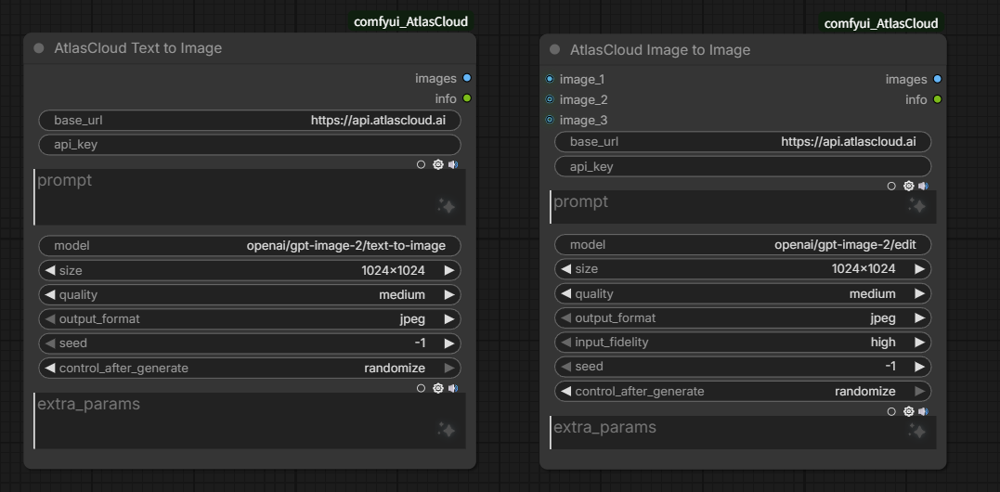

# ComfyUI AtlasCloud

Image generation nodes for [atlascloud.ai](https://atlascloud.ai), powered by OpenAI's GPT Image 2 models.



## Features

- **Text to Image** — generate images from text descriptions
- **Image to Image** — edit/transform images using up to 3 reference images
- Full support for GPT Image 2 parameters: quality, size, output format, seed
- Configurable base URL for self-hosted or alternative API endpoints
- Extra JSON params for advanced/custom API features

## Requirements

- ComfyUI
- Python packages: `torch`, `pillow`, `numpy`, `requests`

## Installation

```bash
cd ComfyUI/custom_nodes/
git clone https://github.com/clownvary/ComfyUI-AtlasCloud.git
```

Restart ComfyUI (or reload custom nodes). The nodes will appear under the **AtlasCloud** category.

## Nodes

### AtlasCloud Text to Image

Text-to-image generation using GPT Image 2.

| Parameter | Type | Default | Description |
|-----------|------|---------|-------------|
| `base_url` | STRING | `https://api.atlascloud.ai` | API base URL |
| `api_key` | STRING | — | AtlasCloud API key (required) |
| `prompt` | STRING | — | Text description of the image to generate (required) |
| `model` | STRING | `openai/gpt-image-2/text-to-image` | AI model to use |
| `size` | ENUM | `1024x1024` | Output resolution (width x height) |
| `quality` | ENUM | `medium` | Generation quality: `low`, `medium`, `high` |
| `output_format` | ENUM | `jpeg` | Output image format: `jpeg`, `png` |
| `seed` | INT | `-1` | Random seed for reproducibility (-1 = random) |
| `extra_params` | STRING | — | Additional JSON parameters merged into the API request body |

**Outputs:** `IMAGE` (tensor), `STRING` (info JSON)

---

### AtlasCloud Image to Image

Image editing/transformation using up to 3 reference images.

| Parameter | Type | Default | Description |
|-----------|------|---------|-------------|
| `base_url` | STRING | `https://api.atlascloud.ai` | API base URL |
| `api_key` | STRING | — | AtlasCloud API key (required) |
| `image_1` | IMAGE | — | Primary reference image (required) |
| `prompt` | STRING | — | Description of how to edit the image(s) (required) |
| `image_2` | IMAGE | — | Secondary reference image (optional) |
| `image_3` | IMAGE | — | Tertiary reference image (optional) |
| `model` | STRING | `openai/gpt-image-2/edit` | AI model to use |
| `size` | ENUM | `1024x1024` | Output resolution (width x height) |
| `quality` | ENUM | `medium` | Generation quality: `low`, `medium`, `high` |
| `output_format` | ENUM | `jpeg` | Output image format: `jpeg`, `png` |
| `input_fidelity` | ENUM | `high` | Detail preservation: `high` (keep faces/logos), `low` (more creative freedom) |
| `seed` | INT | `-1` | Random seed for reproducibility (-1 = random) |
| `extra_params` | STRING | — | Additional JSON parameters merged into the API request body |

**Outputs:** `IMAGE` (tensor), `STRING` (info JSON)

## Supported Resolutions

| Tier | Resolutions |
|------|-------------|
| 1K | `1024x768`, `768x1024`, `1024x1024`, `1024x1536`, `1536x1024` |
| 2K | `1920x1080`, `1080x1920`, `2560x1440`, `1440x2560` |
| 3K | `3840x2160`, `2160x3840` |

## License

MIT
